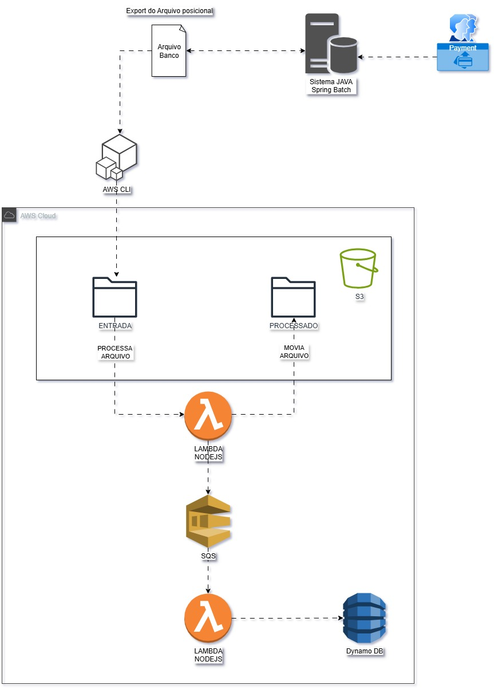

# Pipeline S3 → Lambda → SQS → Lambda → DynamoDB

> Repositório exemplo para implementar o fluxo do diagrama S3 (arquivo do banco) que você enviou.

## Visão geral

O pipeline implementa o fluxo mostrado no diagrama:

1. O sistema do banco exporta um arquivo posicional (fix-width) e, usando `aws cli` ou outro mecanismo, faz upload para o bucket S3 dentro do prefixo `entrada/`.
2. Um evento `s3:ObjectCreated:*` dispara a **Lambda (InputProcessor)** escrita em Node.js.
3. A Lambda lê o arquivo, processa cada linha/registro (ou monta mensagens conforme sua regra de negócio) e publica mensagens na **fila SQS (WorkerQueue)**. Depois move o arquivo para `processado/` (ou `processado/<timestamp>/`), garantindo rastreabilidade.
4. Outra **Lambda (OutputProcessor)** é acionada pela fila SQS (trigger SQS). Essa Lambda consome mensagens e grava dados estruturados no **DynamoDB**.



---

## Pré-requisitos

* Conta AWS com permissões para criar S3, Lambda, SQS, DynamoDB e IAM.
* `aws` CLI configurado (`aws configure`).
* Node.js (>= 18) para localizar dependências locais.
* AWS SAM CLI (opcional, usei SAM no exemplo para deploy simples). Alternativa: Serverless Framework, Terraform ou CloudFormation.

---

## Estrutura sugerida do repositório

```
repo-root/
├─ README.md                # este arquivo
├─ template.yaml            # SAM template (infra as code)
├─ src/
│  ├─ inputProcessor.js     # Lambda que processa o arquivo S3 e envia mensagens para SQS
│  ├─ outputProcessor.js    # Lambda que consome SQS e escreve no DynamoDB
│  └─ package.json
├─ sample/                  # arquivos de exemplo para testes
│  └─ sample-bank-export.txt
└─ .gitignore
```

---

## template.yaml (AWS SAM)

> Este arquivo cria: bucket S3, fila SQS, tabela DynamoDB e 2 Lambdas. Ajuste nomes/paths conforme necessário.

```yaml
AWSTemplateFormatVersion: '2010-09-09'
Transform: AWS::Serverless-2016-10-31
Description: S3 -> Lambda -> SQS -> Lambda -> DynamoDB example

Globals:
  Function:
    Runtime: nodejs18.x
    Timeout: 30
    MemorySize: 256

Resources:
  ProcessingBucket:
    Type: AWS::S3::Bucket

  WorkerQueue:
    Type: AWS::SQS::Queue

  RecordsTable:
    Type: AWS::DynamoDB::Table
    Properties:
      AttributeDefinitions:
        - AttributeName: id
          AttributeType: S
      KeySchema:
        - AttributeName: id
          KeyType: HASH
      BillingMode: PAY_PER_REQUEST

  InputProcessorFunction:
    Type: AWS::Serverless::Function
    Properties:
      Handler: inputProcessor.handler
      CodeUri: src/
      Events:
        S3Put:
          Type: S3
          Properties:
            Bucket: !Ref ProcessingBucket
            Events: s3:ObjectCreated:*
            Filter:
              S3Key:
                Rules:
                  - Name: prefix
                    Value: entrada/
      Environment:
        Variables:
          WORKER_QUEUE_URL: !Ref WorkerQueue
      Policies:
        - PolicyName: InputProcessorPolicy
          PolicyDocument:
            Version: '2012-10-17'
            Statement:
              - Effect: Allow
                Action:
                  - s3:GetObject
                  - s3:PutObject
                  - s3:DeleteObject
                Resource: !Sub "${ProcessingBucket.Arn}/*"
              - Effect: Allow
                Action:
                  - sqs:SendMessage
                Resource: !GetAtt WorkerQueue.Arn

  OutputProcessorFunction:
    Type: AWS::Serverless::Function
    Properties:
      Handler: outputProcessor.handler
      CodeUri: src/
      Events:
        SQSEvent:
          Type: SQS
          Properties:
            Queue: !GetAtt WorkerQueue.Arn
      Environment:
        Variables:
          TABLE_NAME: !Ref RecordsTable
      Policies:
        - PolicyName: OutputProcessorPolicy
          PolicyDocument:
            Version: '2012-10-17'
            Statement:
              - Effect: Allow
                Action:
                  - dynamodb:PutItem
                Resource: !GetAtt RecordsTable.Arn

Outputs:
  BucketName:
    Value: !Ref ProcessingBucket
  QueueUrl:
    Value: !Ref WorkerQueue
  TableName:
    Value: !Ref RecordsTable
```

> Observação: se preferir, remova `Bucket` do template e crie o bucket manualmente (útil se quiser controle do nome globalmente único). Ao criar manualmente, garanta que a notificação do S3 aponte para a Lambda (ou configure via SAM/Event) ou use S3 -> SNS -> Lambda se desejar maior controle.

---

## Código: `src/inputProcessor.js`

```js
// src/inputProcessor.js
const { S3Client, GetObjectCommand, CopyObjectCommand, DeleteObjectCommand } = require('@aws-sdk/client-s3');
const { SQSClient, SendMessageCommand } = require('@aws-sdk/client-sqs');

const s3 = new S3Client();
const sqs = new SQSClient();

const streamToString = async (stream) => new Promise((resolve, reject) => {
  const chunks = [];
  stream.on('data', (chunk) => chunks.push(Buffer.from(chunk)));
  stream.on('error', reject);
  stream.on('end', () => resolve(Buffer.concat(chunks).toString('utf-8')));
});

exports.handler = async (event) => {
  console.log('Event recebido:', JSON.stringify(event, null, 2));

  try {
    const record = event.Records[0];
    const bucket = record.s3.bucket.name;
    const key = decodeURIComponent(record.s3.object.key.replace(/\+/g, ' '));

    // 1) Obter o objeto
    const getResp = await s3.send(new GetObjectCommand({ Bucket: bucket, Key: key }));
    const body = await streamToString(getResp.Body);

    // 2) Processar linhas (exemplo simples)
    const lines = body.split(/\r?\n/).filter(Boolean);

    for (const line of lines) {
      // Exemplo: criar mensagem a partir da linha (ajuste conforme seu layout posicional)
      const message = {
        raw: line,
        sourceKey: key,
      };

      // Enviar para SQS
      await sqs.send(new SendMessageCommand({
        QueueUrl: process.env.WORKER_QUEUE_URL,
        MessageBody: JSON.stringify(message),
      }));
    }

    // 3) Mover arquivo para processado/
    const destKey = key.replace(/^entrada\//, 'processado/');
    await s3.send(new CopyObjectCommand({
      Bucket: bucket,
      CopySource: `${bucket}/${key}`,
      Key: destKey,
    }));

    // 4) Deletar origem
    await s3.send(new DeleteObjectCommand({ Bucket: bucket, Key: key }));

    console.log(`Arquivo ${key} processado e movido para ${destKey}`);
  } catch (err) {
    console.error('Erro no processamento:', err);
    throw err; // Lança para que Lambda registre falha (retries podem ocorrer)
  }
};
```

---

## Código: `src/outputProcessor.js`

```js
// src/outputProcessor.js
const { DynamoDBClient } = require('@aws-sdk/client-dynamodb');
const { DynamoDBDocumentClient, PutCommand } = require('@aws-sdk/lib-dynamodb');

const db = new DynamoDBClient();
const ddbDoc = DynamoDBDocumentClient.from(db);

exports.handler = async (event) => {
  console.log('SQS event:', JSON.stringify(event, null, 2));

  for (const rec of event.Records) {
    try {
      const payload = JSON.parse(rec.body);

      // Construa o item conforme sua modelagem
      const item = {
        id: payload.id ?? `msg-${Date.now()}-${Math.random().toString(36).slice(2,7)}`,
        raw: payload.raw,
        sourceKey: payload.sourceKey,
        processedAt: new Date().toISOString(),
      };

      await ddbDoc.send(new PutCommand({ TableName: process.env.TABLE_NAME, Item: item }));
      console.log('Item gravado:', item.id);
    } catch (err) {
      console.error('Erro ao processar mensagem SQS:', err, rec.body);
      // Decida: lançar erro (para re-queue) ou continuar e enviar para DLQ
      throw err;
    }
  }
};
```

---

## `package.json` (exemplo)

```json
{
  "name": "s3-lambda-sqs-dynamodb-pipeline",
  "version": "1.0.0",
  "private": true,
  "dependencies": {
    "@aws-sdk/client-s3": "^3.x",
    "@aws-sdk/client-sqs": "^3.x",
    "@aws-sdk/client-dynamodb": "^3.x",
    "@aws-sdk/lib-dynamodb": "^3.x"
  }
}
```

---

## Deploy com SAM (passo a passo)

1. `sam build`
2. `sam deploy --guided` (preencha nome de stack, região, criar role se desejar)

O `sam deploy --guided` vai pedir parâmetros e criar o stack com S3, SQS, DynamoDB e as Lambdas.

---

## Testes manuais

1. Faça upload de um arquivo de exemplo (`sample/sample-bank-export.txt`) para o bucket no prefixo `entrada/`:

```bash
aws s3 cp sample/sample-bank-export.txt s3://<bucket-name>/entrada/sample-bank-export.txt
```

2. Verifique logs da Lambda InputProcessor no CloudWatch; verifique se as mensagens foram enviadas para a fila SQS.
3. Observe a execução da Lambda OutputProcessor (CloudWatch) e veja os itens no DynamoDB.

---

## Dicas operacionais e pontos importantes

* **Idempotência:** se a Lambda falhar parcialmente, tenha cuidado com duplicação (usar checks ou upserts no DynamoDB).
* **Tratamento de erros:** use DLQ (Dead Letter Queue) para SQS e configure retry policies nas Lambdas conforme necessidade.
* **Segurança / IAM:** siga o princípio do menor privilégio. No exemplo acima eu dei permissões apenas para os recursos usados.
* **Nomes de buckets:** buckets S3 são globais — evite hardcode do nome no template se quer deploy automático em múltiplas contas.
* **Performance:** se arquivos muito grandes, considere dividir em partes (multipart) ou fazer processamento por chunk para não estourar timeout da Lambda.

---


